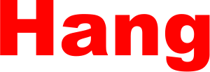
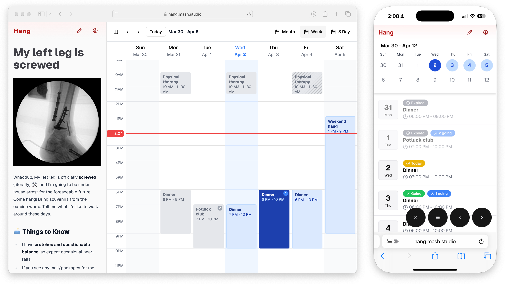

Hang is a modern social calendar that takes the headache out of planning 
recurring events. See who's coming, when they're coming, and keep your 
social life organized - all in one place.

Host everything from weekly game nights to monthly dinner parties with 
ease. Create events, track RSVPs, and let your friends pick the dates 
that work for them. No more endless group chats or spreadsheets.

The magic is in the simplicity. Hosts get a clear view of attendance 
across all dates, while guests can easily mark their availability and 
see who else is joining each event. It's social planning that actually 
makes sense.



## Features

### Completed ✅
- User Authentication (OAuth + Magic Link)
- Calendar Creation & Management
- Event Creation (via Google Calendar)
- Email Notifications

### In Progress 🚧
- Event creation in platform
- User Dashboard
- Admin Dashboard
- Image Upload

## Getting Started

```bash
cd hang
yarn install
cp .env.example .env
yarn dev
```

The application will be available at `http://localhost:3000`


## Project Structure

```
src/
├── app/          # Next.js app router pages
├── components/   # Reusable UI components
├── emails/       # Email templates
├── hooks/        # Custom React hooks
├── lib/          # Utility functions and shared logic
├── server/       # Server-side code
├── styles/       # Global styles
└── trpc/         # tRPC router definitions
```


## License

This project is licensed under the MIT License - see the LICENSE file for details.
